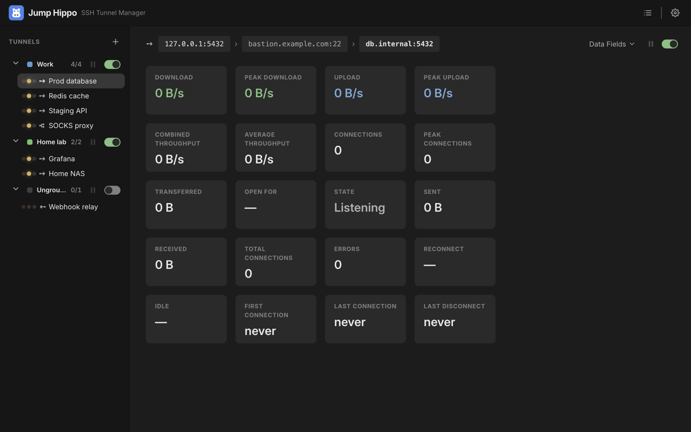

# Jump Hippo User Guide

**Jump Hippo** manages **SSH tunnels that open on demand.** You define a tunnel
once: a local port, where traffic should end up, and the SSH server (and any jump
hosts) to route it through. Jump Hippo binds the local port and waits. The moment
something connects to that port, it opens the SSH tunnel — through a chain of jump
hosts if you need them — holds it open while traffic is flowing, and tears the SSH
connection down again once the port goes idle. The local listener stays bound the
whole time, so the next connection re-opens the tunnel automatically.

It runs quietly in the background from the system tray, holds your SSH credentials
encrypted at rest, and **never phones home**.

## How a tunnel works

```
  your app  ──▶  127.0.0.1:5432   ──ssh──▶  [ jump host … ]  ──ssh──▶  ssh server  ──▶  db:5432
              (the entry port,             (optional multi-hop           (the target        (the exit /
               bound and waiting)           chain)                        server)            destination)
```



1. **Armed** — the tunnel's local **entry port** is bound and listening. No SSH
   connection exists yet.
2. **First access** — an app connects to the entry port. Jump Hippo opens the SSH
   chain (jump hosts, then the target server), authenticates each hop, verifies
   each host key, and forwards your traffic to the **exit port** (the destination).
3. **Live** — the SSH connection is held open while any client is connected, with
   byte counters and connection stats updating in the Monitoring view.
4. **Idle** — after the last client disconnects, Jump Hippo waits the tunnel's
   **idle linger** and then closes the SSH connection. The entry port stays bound,
   ready to open it again on the next access.

You can **pause** a live tunnel to freeze its traffic without tearing anything
down, and **resume** it later.

## The guide

- **[Getting Started](getting-started.md)** — install, define your first tunnel,
  arm it, and watch it connect on demand.
- **[Defining Tunnels](defining-tunnels.md)** — entry port, target server, exit
  port, linger, keep-alive, and auto-reconnect.
- **[Jump Hosts](jump-hosts.md)** — reusable hosts and multi-hop chains.
- **[Authentication](authentication.md)** — SSH agent, private keys, passwords,
  and passphrases.
- **[Host Keys & Trust](host-keys.md)** — how Jump Hippo verifies servers, and
  what a "changed key" warning means.
- **[Consoles](consoles.md)** — open an interactive remote shell to a server,
  reusing the same credentials, jump hosts, and host-key trust as a tunnel.
- **[Monitoring & Pause](monitoring.md)** — live stats, the Cards and List views,
  groups, and pause/resume.
- **[Import & Export](import-export.md)** — move a setup between machines, back it up,
  or seed a fresh install from your `~/.ssh/config`.
- **[Tray & Background](tray-and-background.md)** — hide-to-tray, launch-at-login,
  and quit behaviour.
- **[Security](security.md)** — binding scope, where secrets live, host-key trust,
  and Jump Hippo's privacy posture.
- **[Troubleshooting](troubleshooting.md)** — port already in use, privileged
  ports, connection failures, and reconnects.

> Jump Hippo is open source under the Apache 2.0 license. The source, issue
> tracker, and build instructions are on
> [GitHub](https://github.com/jfigge/jumphippo#readme).
